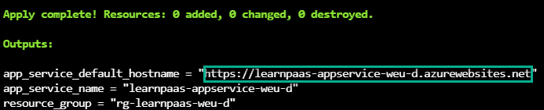

# App Service: Azure PaaS

Azure App Service is a fully managed service for building, deploying, and scaling your web apps, web APIs and other service side workloads. App service is azure PaaS offering, PaaS stands for **Platform as a Service**.

[Heroku](https://www.heroku.com/) was the first company to introduce PaaS-like offering.

## What are the benefits of PaaS?

Modern software infrastructure is pretty complicated, form VMs, to containers. From monolithic applications to serverless, from on-prem to hybrid modes. Everything is more connected, IoT and edge requirements push the boundaries of what is considered possible every day! Technologies like [WASM](https://webassembly.org/), [RISC-V](https://riscv.org/), Kubernetes, Machine Learning & AI, Quantum Computing and many more will completely revolutionize how software is created, delivered and personalized.

This is all great, but how should developers keep up with all the building and deployment options? How to easily monitor and operationalizing all those various workloads? That's there PaaS comes in.

PaaS bridges the gap between underlying hosting platform and running workloads, by providing a **good balance between opinionated defaults and configuration options**.

> In other words a good PaaS offering will be flexible enough to accommodate for different needs and workloads and intelligent enough to hide infrastructure  complexity by providing smart abstraction layer to work with.

### Choose where to host your micro(service)

Azure, like any other major cloud provider, offers a lot of services to choose from. Most often than not, the sheer number of options and services is just plain confusing. Below diagram guides you through the decision process and helps understand where PaaS offering is a good choice.

In general, if you have a workloads that will be consumer facing via http(s), like a web page, web api, etc, Azure App Service is a good choice.


*source: [Azure docs](https://docs.microsoft.com/en-us/azure/architecture/guide/technology-choices/compute-decision-tree)*

Other than standard hosting options, now it is possible to run App Service on Azure Arc enabled Kubernetes anywhere. This is a pretty interesting feature, because it extends Azure App Service control plane and runs it on top of Kubernetes, meaning that if you have App Services running in Azure already,you could run them for example on-prem on a Kubernetes cluster and still use Azure App Service abstraction as you would in Azure itself.


*please refer to [this blog](https://azure.microsoft.com/en-us/blog/build-cloudnative-applications-that-run-anywhere/#azure-application-services:-run-your-apps-anywhere) for more details*

### Choose App Service SKU plan

Finally, in order to run our App Service, we need to select a SKU (Stock Keeping Unit) plan that will define the capabilities of the underlying infrastructure.

Here we can decide how much CPU and RAM should our infrastructure have, what are the auto-scaling rules and other features, like support for custom certificates or custom domain names etc.

> for full list of available configuration options please refer to [Azure Docs](https://docs.microsoft.com/en-us/azure/app-service/overview-hosting-plans)

Since there is no good graphical representation helping us choose between SKUs (similar to the one helping us choose between hosting options for our service), I have created one:


## Demo

We are going to deploy Azure infrastructure and use App Service with Azure Container Registry to deploy a sample web app running in a docker container.

### Infrastructure

To setup our testing infrastructure, we will take advantage of the fact that Azure Cloud Shell comes with pre-installed terraform.

You don't need to be familiar with terraform, all commands will be provided, but remember **always check scripts from internet before executing**. All scripts are part of the learning repository [here](https://github.com/ilearnazuretoday/create-app-service/tree/main/terraform).

Login to Azure portal and select Cloud Shell. Follow [this tutorial](https://docs.microsoft.com/en-us/azure/cloud-shell/overview) to activate cloud shell if you are login for the first time on a fresh account.

Once you are in cloud shell, make sure to select *bash* environment and follow the steps below.

```bash
# Clone the exercise repository
git clone https://github.com/ilearnazuretoday/create-app-service

# Switch to right directory
cd create-app-service/terraform

# Initialize terraform with Azure Provider
terraform init

# Validate terraform scripts
terraform plan

# Create infrastructure, confirm with "yes"
terraform apply
```

The above commands should create our Azure infrastructure and. Go ahead and copy the URL from terraform output and you should see a [sample PWA web page](https://hub.docker.com/repository/docker/piotrzan/blazorindocker) form my Docker Hub registry



### Deploying an app

From here we have various options to play around with deploying a sample html page from the nginx-demo folder, replacing the app service container with antoher one, setting up CI/CD pipeline etc. If you are interested, follow along with the instructions.

Retrieve login details to our Azure Container Registry so we can push an image with the sample web app

```bash
# Capture resource group name output from terraform into a variable
export RG_NAME=$(terraform output --raw resource_group)

# Capture ACR name output from terraform into a variable
export ACR_NAME=$(terraform output --raw acr_name)

# Capture app service name into a variable
export APP_NAME=$(terraform output --raw app_service_name)

# Obtain user name for the ACR
export ACR_USERNAME=$(az acr credential show --resource-group $RG_NAME_ --name $ACR_NAME --query username)

# Obtain password for the ACR
export ACR_PASSWORD=$(az acr credential show --resource-group $RG_NAME_ --name $ACR_NAME --query passwords[0].value)
```

#### Build image locally form Azure Cloud shell

Since docker daemon is not running in the cloud shell VM, we have to use *az acr build* command to build an image and deploy it to ACR.

```bash
# Navigate to folder with demo app
cd ../nginx-demo

# Use az cli to build and upload container to ACR
az acr build --image nginx-demo:1.0 \
    --registry $ACR_NAME \
    --file Dockerfile .
```

#### Set newly pushed image for our App Service

No we can set the image for our App Service. Please note that all those actions are done in an "imperative" way for educational purposes. In real life scenarios CI/CD pipelines would be setup to handle the flow of change and updates

```bash
az webapp config container set --name $APP_NAME \
    --resource-group $RG_NAME \
    --docker-custom-image-name nginx-demo:1.0 \
    --docker-registry-server-url "https://$ACR_NAME.azurecr.io" \
    --docker-registry-server-user $ACR_USERNAME \
    --docker-registry-server-password $ACR_PASSWORD
```

Give it a moment so that Azure can refresh the image and navigate to the same address, you should see an nginx demo page.

### Destroy the Infrastructure

This step is **IMPORTANT**, so that you will avoid unnecessary charges. Let's remove the resources, it is very easy to do this with terraform.

```bash
# Navigate to folder with demo app
cd ../terraform

# Destroy all resources, confirm with yes
terraform destroy
```

## Conclusion

Azure PaaS, App Service is a very versatile and powerfully service. We have learned when to use it, how to select right SKU, finally how to deploy a sample workload following **infrastructure as code** practices.

